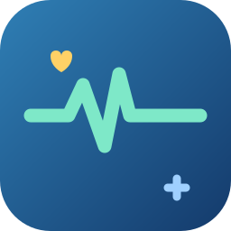

<p align="center"></p>

<h1 align="center">🩺 Health Condition Tracker（健康管理技能包）</h1>

    [](https://qhj-1.github.io/health-condition-tracker/)

> 长期、全面、**符合一般人体感**地记录身体症状、生活习惯、用药与治疗方案；
> 结合**国际权威指南（NHS / Mayo Clinic / CDC / WHO）**做风险分级与就诊路径建议；
> 支持多家人档案、图表可视化、报告单/体检单 OCR 解读、全国十大医院推荐、联网交叉验证搜索。

## ✨ 功能一览（24 项）

1. 病情录入向导（多档案开关 → 录入 → 补充既往 → 追问 → 选档案 → 可视化 → 视图报告）
2. 症状收集（结构化：位置/时间/程度/影响）
3. 报告分析（化验单/体检单 OCR 解读 + 异常标记 + 危急值提醒 + 历史对比）
4. 知识库查询 + 多引擎联网搜索（DuckDuckGo/Bing/Mojeek/维基，官方来源优先、交叉验证）
5. 记录追踪（低频友好：隔几周回来一条命令接上）
6. 用药管理（含相互作用提醒）
7. 治疗方案跟踪（诊断/建议/复诊）
8. 个性化健康建议（饮食/运动/睡眠/压力/戒烟限酒）
9. 医生沟通报告（Markdown，脱敏）
10. 风险预警（两档：真紧急 vs 警惕，不吓人）
11. 多家人档案（`--member` 分目录 + 开关）
12. 图表可视化（症状频次/趋势/体征 PNG）
13. 日历热力图
14. 复诊/停药提醒（含忽略管理）
15. 间隔期总览（低频快照）
16. 病情视图报告（HTML，时间线+统计+图表+建议科室+参考范围）
17. 建议科室（44+ 症状 → 科室）
18. 一键备份导出（zip + CSV，防公式注入，自动轮转）
19. 紧急红牌提示（严重程度≥9 或真急症才升级）
20. 就诊意见 + 全国十大医院（结合患者位置给性价比方案）
21. 联网资料客观摘要（分析不被网络信息带偏）
22. 难受程度客观评估（快速 3 题可选填 / 完整 7 维）
23. 报告单/体检单/CT 报告文字解读（OCR + 参考范围 + 危急值）
24. 国际权威就诊路径（NHS/Mayo/CDC/WHO，5 档 + 时间窗 + 升级条件，不搞一刀切）

## 🌐 网页版（纯前端，免安装）

**https://qhj-1.github.io/health-condition-tracker/**

手机 / 电脑浏览器直接打开即用，**无需服务器、无需 Python**。数据只保存在你自己的浏览器（localStorage），支持导出 / 导入备份，可离线使用。

功能：
- 病情录入向导（多档案 → 症状 → 程度 → 追问 → 保存）
- 风险分级分析（与桌面版同一套算法，116 组回归通过、不吓人）
- 国际权威就诊路径（NHS/Mayo/CDC/WHO）+ 全国十大医院推荐（按所在城市排序）
- 图表可视化 + 日历热力图
- 用药管理、治疗方案、复诊 / 停药提醒
- 多家人档案、数据导出 / 导入

> 桌面版「指令选择器」仍在：https://qhj-1.github.io/health-condition-tracker/selector.html

## 🚀 快速开始

### 1. 安装（Windows，推荐放 D 盘）
```powershell
cd 技能包目录
.\install-to-D.bat
```
会在 `D:\codex-skills\health-condition-tracker` 建目录，并在 `C:\Users\<你>\.codex\skills` 建联接，Codex 自动加载该技能。

### 2. 常用命令
```powershell
cd D:\codex-skills\health-condition-tracker
python scripts\self_test.py                    # 回归测试（100 组正常人 + 16 组边界）
python scripts\intake.py                        # 病情录入向导
python scripts\analyze.py 腹痛 --severity 5 --duration 2天 --trend 平稳   # 病情分析（含病程判断+就诊路径）
python scripts\lab_analyzer.py "报告单.jpg" --member 妈妈 --compare       # 报告单解读
python scripts\hospital_advice.py --member 妈妈 --city 杭州 --budget 普通  # 就诊意见+医院推荐
python scripts\web_search.py "高血压 防治指南" --official                  # 只看官方来源
python scripts\export_data.py --all-members                               # 一键备份
```

### 3. 在 Codex 对话中使用
直接说「记录一下病情 / 帮我看这份报告 / 最近咳嗽怎么办」，技能会自动触发。首次会询问是否开启多家人档案。

## 📁 目录结构
```
health-condition-tracker/
├── SKILL.md                 # 技能主说明（Codex 自动加载）
├── README.md
├── agents/openai.yaml
├── docs/                    # 网页版应用（app/）+ 指令选择器 + 对话模板
├── references/              # 知识库（症状/科室/医院/就诊路径/检验参考等 13 份）
├── scripts/                 # 24 个 Python 脚本
├── tests/                   # 回归测试数据（100 组正常人 + 16 组边界）
├── install-to-D.bat / install.ps1
└── .gitignore               # 个人健康数据已被排除
```

## 🔒 隐私说明
- 所有数据只保存在**你的本地**（技能目录 / `scripts/members/<名字>/`）。
- 本仓库**不含任何个人健康数据**：`members/`、`health_log.json`、`members_config.json`、`backups/` 等已在 `.gitignore` 中排除。
- 联网搜索只发送你主动发起的查询词，不自动上传健康记录。

## 🧪 回归测试
`tests/` 内置 **100 组正常人 + 16 组边界**数据，验证风险分级符合一般人体感：
```powershell
python scripts\self_test.py             # 全部
python scripts\self_test.py --only edge # 只看边界
```

## ⚠️ 免责声明
本技能所有内容仅供参考，不能替代专业医疗诊断、治疗或处方。风险分级是保守筛查，用于提醒就医时机，不构成诊断；请以医生意见为准。

## 📄 License
MIT（本仓库当前仅包含技能代码与知识库；医院/检验数据整理自公开资料，仅供挂号参考）。